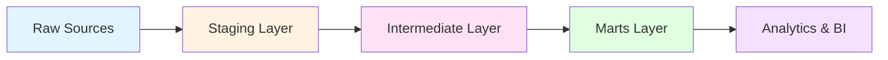
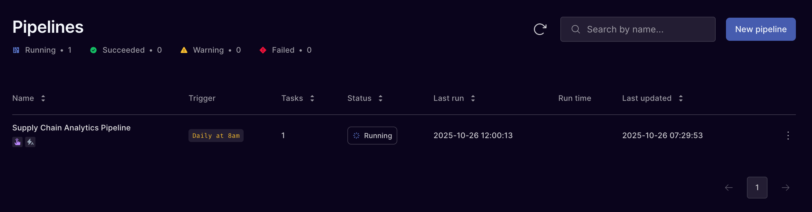
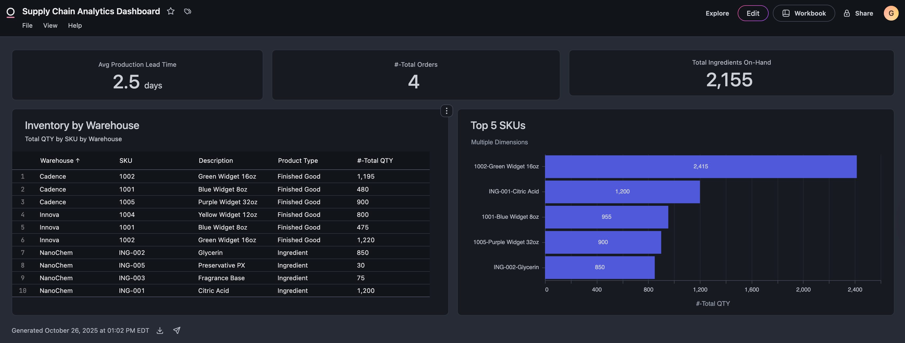

# 📦 Supply Chain Analytics Platform

_An end-to-end modern data stack integrating **dbt Fusion**, **Orchestra**, and **Omni Analytics**_

> **A complete analytics solution from transformation to orchestration to self-service business intelligence**

[](https://www.getdbt.com/)
[](https://www.snowflake.com/)


## Overview

This project provides a comprehensive analytics framework for data-driven supply chain operations by integrating data from multiple manufacturing and distribution systems to deliver actionable insights on inventory levels, production capacity, and material constraints.

### Data Stack

This projects features 3 tools to deliver a complete analytics solution:

1. **[dbt Fusion](https://www.getdbt.com/product/fusion)** - dbt's latest engine built on Rust
2. **[Orchestra](https://www.getorchestra.io/)** - Zero-maintenance pipeline orchestration with intelligent monitoring and auto-recovery
3. **[Omni Analytics](https://omni.co/)** - Self-service business intelligence platform enabling stakeholders to explore data independently


---

## Project Architecture

```
supply_chain/
├── models/
│   ├── staging/           # Source system integrations
│   │   ├── cadence/       # Distribution & order management
│   │   ├── mar-kov/       # Raw materials inventory
│   │   └── nulogy/        # Manufacturing operations
│   ├── intermediate/      # Business logic transformations
│   │   └── operations/    # Supply chain operations
│   └── marts/             # Analytics-ready models
│       └── operations/    # Production & inventory analytics
├── macros/                # Reusable SQL functions
└── seeds/                 # Reference data
```

### Data Flow



---

## Data Sources

### 1. Nulogy (Manufacturing)
- **Finished Goods Inventory**: Product inventory levels with room-level granularity
- **Work Orders**: Production planning and execution data
- **Inventory Consumption**: Raw material usage per work order

### 2. Cadence (Distribution)
- **Inventory FG Report**: Distribution center inventory levels
- **Orders**: Customer order master data
- **Order Status Events**: Order lifecycle tracking

### 3. Mar-Kov (Raw Materials)
- **Raw Ingredients**: Raw material inventory with lot tracking and expiry dates

---

## Custom Macros

Our project includes powerful reusable macros for data standardization:

| Macro | Purpose | Example |
|-------|---------|---------|
| `flexible_timestamp()` | Parses multiple date formats | Handles ISO 8601, US-style, slash-separated dates |
| `normalize_uom()` | Standardizes units of measure | `'kg'` → `'KG'`, `'each'` → `'EA'` |
| `normalize_sku()` | Cleans product identifiers | Removes special characters, uppercase |
| `string_to_number()` | Converts formatted strings to numbers | `'1,200'` → `1200` |
| `convert_to_base_uom()` | Converts between units | Unit conversion logic |

---

## Key Models

### Staging Models

#### Cadence
- `stg_cadence__inventory_fg_report` - Distribution center inventory
- `stg_cadence__orders` - Customer orders
- `stg_cadence__order_status_events` - Order tracking events

#### Mar-Kov
- `stg_mar_kov__raw_ingredients` - Raw material inventory with lot tracking

#### Nulogy
- `base_nulogy__finished_goods_inventory` - Base manufacturing inventory
- `stg_nulogy__finished_goods_inventory` - Exploded room-level inventory
- `stg_nulogy__work_orders` - Production work orders
- `stg_nulogy__inventory_consumption` - Material consumption tracking

### Intermediate Models

- `int_ingredient_consumption_rates` - Average consumption per unit produced
- `int_current_ingredient_inventory` - Latest ingredient inventory snapshot
- `int_warehouse_inventory` - Aggregated finished goods across warehouses

### Marts

- `fg_forecast` - Production capacity forecast with bottleneck analysis
- `inventory` - Comprehensive inventory analytics

---

## Getting Started

### Prerequisites

- dbt platform, dbt core or dbt Fusion
- Snowflake account with appropriate permissions
- Python 3.8+

### Installation

1. **Clone the repository**
   ```bash
   git clone <repository-url>
   cd supply-chain-dbt/supply_chain
   ```

2. **Install dependencies**
   ```bash
   dbt deps
   ```

3. **Configure your profile**
   
   Update `~/.dbt/profiles.yml`:
   ```yaml
   supply_chain:
     target: dev
     outputs:
       dev:
         type: snowflake
         account: <your-account>
         user: <your-username>
         password: <your-password>
         role: <your-role>
         database: <your-database>
         warehouse: <your-warehouse>
         schema: <your-schema>
         threads: 4
   ```

4. **Load seed data**
   ```bash
   dbt seed
   ```

5. **Run the project**
   ```bash
   dbt build
   ```

---

## Automation

*Supply Chain Analytics Pipeline running in Orchestra*

This project uses [Orchestra](https://www.getorchestra.io/) for pipeline orchestration and scheduling.

### Production Pipeline

Our **Supply Chain Analytics Pipeline** runs automatically in production:

- **Schedule**: Daily at 8:00 AM ET
- **Environment**: Production
- **Orchestrator**: Orchestra
- **Tasks**: Full data refresh across all models

### Why Orchestra?

Orchestra provides:

- **Zero-Maintenance Orchestration**: Managed solution that scales with your data team
- **Full Stack Observability**: Real-time monitoring of all metadata and pipeline health
- **Intelligent Alerting**: Proactive notifications before issues impact stakeholders
- **Auto-Recovery**: Automatic retries and failure recovery without manual intervention
- **AI-Native Architecture**: Built for modern data teams working with AI workflows

### Pipeline Monitoring

Track your pipeline status in real-time through the Orchestra dashboard:
- View run history and execution times
- Monitor task-level progress
- Get instant alerts on failures
- Review lineage and dependencies

Learn more about Orchestra's [data orchestration capabilities](https://www.getorchestra.io/).

---

## Business Intelligence with Omni Analytics


*Interactive Supply Chain Analytics Dashboard in Omni*

This project leverages [Omni Analytics](https://omni.co/) to deliver powerful, self-service business intelligence capabilities to stakeholders across the organization.

Learn more about [Omni's business intelligence capabilities](https://omni.co/).

---

## Usage Examples

### Run specific model groups

```bash
# Build all staging models
dbt build --select staging.*

# Build intermediate models
dbt build --select intermediate.*

# Build marts
dbt build --select marts.*

# Build specific source
dbt build --select staging.nulogy.*
```

### Test data quality

```bash
# Run all tests
dbt test

# Test specific model
dbt test --select fg_forecast
```

### Generate documentation

```bash
# Generate and serve docs
dbt docs generate
dbt docs serve
```

---

## Testing Strategy

Our project implements comprehensive data quality tests:

- ✅ **Uniqueness**: Primary keys and surrogate keys
- ✅ **Not Null**: Required business fields
- ✅ **Accepted Values**: Standardized enumerations (UOM, status codes)
- ✅ **Relationships**: Foreign key integrity
- ✅ **Custom Tests**: Business logic validation (e.g., quantities >= 0)

---

## Model Naming Conventions

| Layer | Prefix | Example | Materialization |
|-------|--------|---------|-----------------|
| Staging | `stg_` | `stg_nulogy__work_orders` | View |
| Base | `base_` | `base_nulogy__finished_goods_inventory` | View |
| Intermediate | `int_` | `int_warehouse_inventory` | View/Table |
| Marts | none | `fg_forecast` | Table |

---

## dbt Best Practices

We follow dbt best practices:

1. **One model per file** with clear naming
2. **CTEs for readability** with descriptive names
3. **Comprehensive documentation** in YAML files
4. **Data quality tests** for all models
5. **Reusable macros** for common transformations

---

## Resources

- [dbt Documentation](https://docs.getdbt.com/)
- [dbt Best Practices](https://docs.getdbt.com/guides/best-practices)
- [dbt Discourse](https://discourse.getdbt.com/)
- [dbt Slack Community](https://www.getdbt.com/community/join-the-community/)

---

## License

This project is licensed under the MIT License.

---

## Developed By

**Gideon Fernandez**  
Founder & CEO at Velocity Sense

[gideon@velocitysense.com](mailto:gideon@velocitysense.com)  
[LinkedIn](https://www.linkedin.com/in/gideonfernandez/)